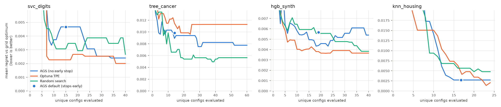

# Tester report: `adaptive-greedy-search` 2.0.0

Package: [pypi.org/project/adaptive-greedy-search](https://pypi.org/project/adaptive-greedy-search/) (import name `ags`), author Mohammad Jawad Hasan.
Tested on 2026-09-25. Environment: cloud Linux container, 4 CPU, no GPU. Python 3.11, scikit-learn 1.9.1, numpy 2.4.6, Optuna 5.0.0.

## TL;DR

- **Works.** Core search is correct: with full budget and no pruning it returns exactly what `GridSearchCV` returns (tested config by config).
- **vs grid search: claim holds on cost.** Using 1%–50% of grid's configs (depending on task and settings), AGS picked configs within about 0.002–0.01 reference-CV score of the grid optimum, and its held-out test scores were in the same range as grid's. On `tree_cancer` grid's pick scored *lower* on test (0.895) than every sampler's average (about 0.92–0.93). Interpretation: exhaustive search over-fits the CV estimate.
- **vs random search and Optuna: no clear edge.** At the same budget of unique configs, AGS (no early stop) had lower mean regret than random on 2 of 4 tasks (clearly on `knn_housing`, marginally on `svc_digits`) and higher on 2 (`tree_cancer`, `hgb_synth`). Optuna TPE was at least as good as AGS on 3 of 4. Differences are small and 10 seeds is not enough to call most of them significant. This agrees with the author's own claim ("not yet better than Optuna").
- **9 bugs or gaps found**, each pinned by a test in `tests/test_ags.py`. Most important: `fit()` does not reset state, and `optimistic` pruning is unsafe with a callable scorer.

## What was tested

| Area | How |
|---|---|
| API and correctness | `tests/test_ags.py`: 13 passing tests + 9 `xfail(strict=True)` bug tests |
| Search quality | `bench/run_benchmark.py`: 4 tasks × 10 seeds × 6 methods + full grid |
| Report | `bench/analyze.py` → `results/summary.md`, `results/pairwise.md`, `results/anytime.png` |

Run it yourself:

```bash
pip install -r requirements.txt
pytest -q tests                  # ~10 s
cd bench && python run_benchmark.py   # ~8 min on 4 cores
python analyze.py
```

## Bugs and gaps

Each has a test that asserts the *correct* behaviour and is marked `xfail(strict=True)`. When the author fixes one, that test will XPASS and pytest will flag it, so the marker can be removed.

| # | Severity | Problem | Repro |
|---|---|---|---|
| 1 | **High** | `fit()` never resets `evaluated`, `history`, the RNG or the pruning stats. A second `fit()` on new data mixes old-data scores into the new search. `history` and `n_evaluations` also stop agreeing (18 vs 17 in the test). | `test_refit_on_new_data_starts_fresh` |
| 2 | **High** | `pruning_strategy="optimistic"` with a callable scorer uses the *highest fold score seen so far* as the upper bound. That is not an upper bound, so it can prune the eventual winner. Scripted repro: incumbent 0.6, candidate folds `[.5,.5,1,1,1]` (true mean 0.8) gets pruned after fold 2. The README says `optimistic` is a guarantee. | `test_optimistic_with_callable_scorer_does_not_prune_winner` |
| 3 | Medium | A single failing config (for example `LogisticRegression(penalty="l1", solver="lbfgs")`) raises and kills the whole search. `GridSearchCV` records `error_score` and continues. | `test_invalid_param_combo_is_skipped` |
| 4 | Medium | `cv` accepts only an int. Splitter objects such as `KFold`, `GroupKFold` and `TimeSeriesSplit` raise, so grouped or time-series data can't be searched correctly. | `test_accepts_cv_splitter_object` |
| 5 | Medium | Not a scikit-learn estimator: no `get_params`, so `clone()` fails and it can't be nested in `Pipeline` or `cross_val_score`. Attribute names drop sklearn's trailing underscore (`best_params`, not `best_params_`). | `test_sklearn_clone_compatible` |
| 6 | Low | No `best_estimator_`, `refit` or `predict`. The user must rebuild and refit the best model by hand. | `test_has_best_estimator` |
| 7 | Low | Typo in `pruning_strategy` (for example `"optimstic"`) is silently accepted and pruning just turns off. | `test_unknown_pruning_strategy_rejected` |
| 8 | Low | `initial_points=0` crashes with `max() arg is an empty sequence`. | `test_initial_points_zero` |
| 9 | Low | `max_evaluations=0` crashes with the same unclear error instead of a clear `ValueError`. | `test_max_evaluations_zero_gives_clear_error` |

Design notes. These are observations, not bugs:

- **Estimator `n_jobs` is forced to 1** and folds run sequentially, so AGS is single-core. `GridSearchCV(n_jobs=-1)` on 4 cores would close much of the wall-clock gap. Every wall time below is single-core for all methods.
- **Early stopping is aggressive by default.** `early_stopping_patience=5` stopped runs after 14–19 evaluations even with a budget of 40–60. On `svc_digits` that roughly doubled regret (0.0047 vs 0.0024).
- **Pruned candidates store their partial mean as `score`**, and that value is also fed to the surrogate. I saw no harm in the benchmark (0 of 30 probe runs had a pruned config as `best_state`), but it biases the surrogate's training data.
- **The surrogate barely changes the outcome.** TPE and GP runs diverge right after the random init (step 8), yet in `svc_digits` and `knn_housing` the TPE and GP runs produced identical regret and test statistics over 10 seeds, which suggests they picked the same final configs. Interpretation: the radius-1 greedy walk decides where the search ends up, and the surrogate mostly decides the order it gets there.
- **Categorical values are treated as ordered** (index distance). `criterion=["gini","entropy","log_loss"]` or `max_depth=[..., None]` get a fake notion of distance. Optuna in this benchmark was given the same index encoding to keep the comparison fair.
- **Pruning saves about 4–12% of folds** at `cv=5` (for example 177 of 200 folds run on `svc_digits`, 115 of 120 on `knn_housing`) and showed no loss in quality. That is a real but modest saving.

What held up:

- Exhaustive mode matches `GridSearchCV` exactly: same best score, and every one of the 70 config means matched.
- `optimistic` pruning with string scorers never pruned a config that would have beaten the incumbent. This was checked by re-running full CV on every pruned config. `optimistic` and `none` also picked the same final config in 20 of 20 seeds.
- Budget is respected, there are no duplicate evaluations, the fold accounting is consistent, the same seed reproduces the same run, and pandas input, `Pipeline` param names, `neg_*` scorers and the GP surrogate all work.

## Benchmark

**Protocol.** Each task's full grid is scored once with a fixed reference 5-fold CV plus a held-out 25% test split. That table *is* the grid-search result, and it serves as a common yardstick for every other method's pick. Every searcher gets the same budget of *unique* configs and the same CV splitter as AGS for each seed. Each searcher picks its winner by its own CV scores.

- `regret` = grid-optimum reference-CV score minus the reference-CV score of the picked config. 0 means it found grid's best.
- Optuna TPE: `suggest_int` on grid indices (the same ordinal information AGS gets). Repeated configs are cached and don't count against the budget.

| Task | Model | Grid | Budget | Scoring |
|---|---|---|---|---|
| `svc_digits` | SVC, C × gamma log grid | 121 | 40 | accuracy |
| `tree_cancer` | DecisionTree, 4 params incl. categorical | 1200 | 60 | accuracy |
| `hgb_synth` | HistGradientBoosting, 4 params | 300 | 40 | roc_auc |
| `knn_housing` | Pipeline(scaler, KNN regressor) | 48 | 24 | neg MSE |

### Mean regret (lower is better), 10 seeds

| method | svc_digits | tree_cancer | hgb_synth | knn_housing |
|---|---|---|---|---|
| grid_search (full) | 0 | 0 | 0 | 0 |
| **ags_default** | 0.0047 | 0.0098 | 0.0057 | 0.0027 |
| **ags_no_early_stop** | 0.0024 | 0.0077 | 0.0054 | 0.0027 |
| ags_gp_no_stop | 0.0024 | 0.0078 | 0.0052 | 0.0027 |
| random | 0.0027 | **0.0056** | 0.0038 | 0.0048 |
| optuna_tpe | **0.0020** | 0.0113 | **0.0037** | **0.0020** |

### Cost: folds fitted / wall seconds (single core)

| method | svc_digits | tree_cancer | hgb_synth | knn_housing |
|---|---|---|---|---|
| grid_search | 605 / 13.2 | 6000 / 36.4 | 1500 / 130.1 | 240 / 3.5 |
| ags_default | 75 / 1.4 | 70 / 0.4 | 93 / 8.6 | 84 / 1.2 |
| ags_no_early_stop | 177 / 3.3 | 268 / 1.3 | 180 / 18.5 | 115 / 1.6 |
| random | 200 / 4.5 | 300 / 1.4 | 200 / 16.6 | 120 / 1.8 |
| optuna_tpe | 200 / 5.5 | 300 / 1.7 | 200 / 22.9 | 120 / 1.9 |

Full tables with standard deviations, held-out test scores and hit-optimum counts: [`results/summary.md`](results/summary.md). Per-seed win/tie/loss: [`results/pairwise.md`](results/pairwise.md).



*Mean regret of the current pick after t unique evaluations. Curves can rise because each method picks its winner by its own (noisy) CV score, not the reference score. The dot marks where AGS with default settings stopped.*

### Reading the numbers

- Seed-to-seed standard deviations (roughly 0.002–0.011) are about the same size as the gaps between methods. With 10 seeds, treat any ranking among AGS, random and Optuna as **not established**.
- AGS's clearest win is the small, smooth `knn_housing` grid (vs random: 4 wins, 6 ties, 0 losses). Its weakest result is the plateau-heavy `tree_cancer` grid, where random search beat it on 6 of 10 seeds.
- The wall-clock advantage over Optuna comes partly from pruning (about 4–12% fewer folds) and partly from Optuna's own sampler overhead. AGS uses slightly *fewer* folds than random at the same budget, but it does not pick better configs.

## Suggestions for the author

1. Reset all per-fit state at the top of `fit()` (fixes #1). Consider making the class a `BaseEstimator` with trailing-underscore attributes (#5, #6).
2. For `optimistic` with a callable scorer, require `score_upper_bound` or refuse to prune (#2).
3. Wrap each fold fit in try/except and record `error_score=np.nan` (#3). Accept any CV splitter via `sklearn.model_selection.check_cv` (#4).
4. Validate constructor args (`pruning_strategy`, `max_evaluations >= 1`, `initial_points >= 1`) (#7–9).
5. Consider a default `early_stopping_patience` tied to budget (for example 25% of `max_evaluations`) rather than a fixed 5.
6. Optionally parallelise across candidates or folds. It is the easiest wall-clock win available.
7. For "heavy-weight tuning" claims, add a benchmark with a larger, more continuous space. The current design is limited to a discrete grid.

## Files

```
ags-testing/
  README.md             this report
  requirements.txt
  tests/test_ags.py     pytest suite (13 pass + 9 strict-xfail bug tests)
  bench/tasks.py        benchmark task definitions
  bench/run_benchmark.py
  bench/analyze.py
  results/              truth tables, runs.csv, curves.csv, summary, plot, log
```
