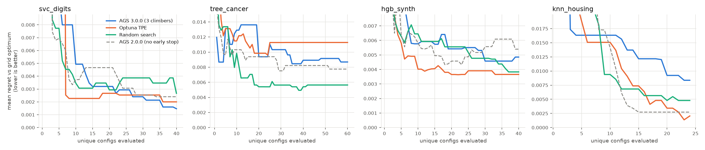
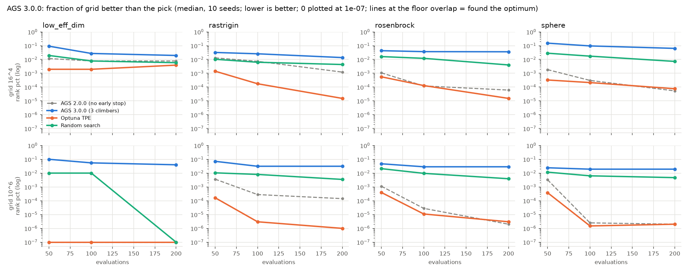
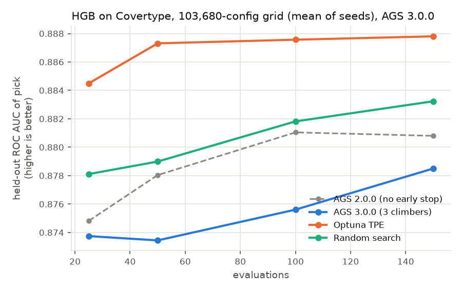

# Re-test: `adaptive-greedy-search` 3.0.0

Re-tested on 2026-10-06 with the same environment, seeds and benchmarks as the 2.0.0 report ([README.md](README.md)): cloud Linux container, 4 CPU, no GPU, Python 3.11, scikit-learn 1.9.1, Optuna 5.0.0. 2.0.0 results are kept in `results/v2.0.0/` and `large/results/v2.0.0/`; 3.0.0 results are in `results/v3.0.0/` and `large/results/v3.0.0/`.

## What changed in 3.0.0

The single climber of 2.0.0 is replaced by a **swarm of climbers** that share one surrogate, one evaluation cache and one pruning engine:

- `n_climbers` start points are chosen by Max-Min (farthest-point) sampling, so they are spread as far apart as possible.
- Each round, every climber proposes its best-UCB unevaluated neighbour, and the batch is evaluated in parallel with joblib (`n_jobs=-1` by default).
- A climber that fails to beat its personal best `climber_patience` times in a row (default 3) is retired. It is replaced at the unvisited point with the highest surrogate uncertainty.
- Global early stopping is now **off by default** (`early_stopping_patience=None`).
- `fit()` now resets all state, and `initial_points` is deprecated and ignored.

This addresses several suggestions from the 2.0.0 report: restarts, more than one search point, no premature global stop, and parallelism.

**How 3.0.0 was benchmarked.** AGS ran with `n_jobs=1` and `n_climbers=3`. 3 is the default on this 4-core machine (75% of cores), and it is fixed so results don't depend on the machine. Every method gets one core per run, and seeds run in parallel. A 1-climber variant (`n_climbers=1`) isolates the effect of the swarm.

## TL;DR

- **Engineering fixes are real.** `fit()` is now safe to call twice (bug #1). The deprecated `initial_points` no longer crashes (#8). Global early stopping is off by default. Parallel evaluation works: 1.9× faster with 3 workers on an expensive model, with identical results.
- **Search quality did not improve, and on large grids it got much worse.**
  - Small grids: about the same as 2.0.0 (paired: 11 better, 14 tied, 15 worse out of 40), and still no clear edge over random or Optuna.
  - Large synthetic grids (65k and 1M points): 3.0.0 **lost to random search** in 68 of 80 paired runs at 200 evaluations, and to 2.0.0 in 72 of 80.
  - Real 103,680-config boosting task: test AUC 0.8785 at 150 evaluations, below 2.0.0 (0.8808), random (0.8832) and Optuna (0.8878).
- **Why (diagnosed, §Diagnosis):**
  - Climbers move to each new point even when it is worse, so they wander instead of climbing.
  - With `climber_patience=3` they are retired after short walks.
  - Max-Min seeding starts them on the grid's edges.
  - 2.0.0 never looked more than 3–4 steps from its best point. 3.0.0 does the opposite: over 90% of evaluations are 6+ steps away from the best point found so far, so the best region is never refined.
- **New performance problem.** Bookkeeping per evaluation now grows with grid size: 2.5 s per evaluation at 10⁷ points, versus 1.5 ms in 2.0.0. A 3.4 × 10⁷-point grid that fit in 2.0.0 now runs out of memory.
- **Still open:** bugs #2–#7 and #9–#10. Also new: the default `n_climbers` depends on the CPU count, so the same seed gives different searches on different machines.
- **Most promising fix (tested by patching):** move only on improvement, plus a patience of about 8. On rosenbrock this brought 3.0.0 back to 2.0.0's level. The edge seeding still needs fixing for smooth landscapes like sphere.

## Bug status

| # | 2.0.0 finding | 3.0.0 |
|---|---|---|
| 1 | `fit()` does not reset state | **Fixed** (`test_refit_on_new_data_starts_fresh` passes) |
| 2 | `optimistic` pruning unsafe with a callable scorer | Still present: the same scripted repro prunes a candidate whose true mean (0.8) beats the incumbent (0.6) |
| 3 | One invalid param combo crashes the search | Still present |
| 4 | `cv` accepts only an int | Still present |
| 5 | Not a scikit-learn estimator (`clone()` fails) | Still present |
| 6 | No `best_estimator_` / `refit` / `predict` | Still present |
| 7 | Typo in `pruning_strategy` silently accepted | Still present |
| 8 | `initial_points=0` crashes | **Resolved**: the argument is deprecated and ignored, with a `DeprecationWarning` |
| 9 | `max_evaluations=0` crashes with an unclear error | Still present |
| 10 | Whole grid held in memory | Still present, and worse: see [Scaling](#scaling-a-large-regression) |
| 11 | *New:* default `n_climbers` is 75% of CPU cores | The same `random_state` gives a different search on a 2-core machine than on a 16-core one (`test_default_is_reproducible_across_machines`) |
| 12 | *New:* per-evaluation overhead grows with grid size | 2.5 s of bookkeeping per evaluation on a 10⁷-point grid (was 1.5 ms) |
| 13 | *New:* climbers move downhill, and start at the grid's edges | Main cause of the large-grid quality regression; see [Diagnosis](#diagnosis-why-the-swarm-is-worse-on-large-grids) |

Test suite on 3.0.0 (`pytest -q tests`): **20 passed, 8 xfailed**. Each xfail is checked to fail at its intended assertion.

## Small grids (same 4 tasks as round 1)

Mean regret vs the grid optimum over 10 seeds (lower is better). Full tables: [`results/v3.0.0/summary.md`](results/v3.0.0/summary.md), per-seed: [`results/v3.0.0/pairwise.md`](results/v3.0.0/pairwise.md).

| method | svc_digits | tree_cancer | hgb_synth | knn_housing |
|---|---|---|---|---|
| AGS 3.0.0 (3 climbers) | **0.0015** | 0.0087 | 0.0049 | 0.0084 |
| AGS 3.0.0 (1 climber) | 0.0021 | 0.0073 | 0.0050 | 0.0104 |
| AGS 3.0.0 (GP surrogate) | **0.0011** | 0.0068 | 0.0040 | 0.0027 |
| AGS 2.0.0 (no early stop) | 0.0024 | 0.0077 | 0.0054 | 0.0027 |
| random | 0.0027 | **0.0056** | 0.0038 | 0.0048 |
| optuna_tpe | 0.0020 | 0.0113 | **0.0037** | **0.0020** |



*Dashed grey line: AGS 2.0.0 with early stopping off, for comparison.*

- **3.0.0 vs 2.0.0, paired by seed:** 11 better, 14 tied, 15 worse across the 40 runs. This is effectively no change. It was better on `svc_digits` and `hgb_synth`, and worse on `knn_housing` (a 48-point grid, where 3 edge-seeded climbers waste a large share of a 24-evaluation budget).
- **vs random and Optuna:** still no clear edge, the same picture as 2.0.0.
- **The GP surrogate** was the best AGS variant on 3 of 4 tasks in 3.0.0. With 10 seeds that is a hint, not a result.
- **Pruning saves less:** 3–9% of folds (2.0.0: 4–12%). Interpretation: inside a parallel batch, each candidate only sees the percentile history from before the batch, so it has fewer points to compare against.

## Large search spaces

### Synthetic landscapes (exact ground truth)

Same landscapes, noise and seeds as round 2 ([`large/README.md`](large/README.md)). The 16⁴ and 10⁶ grids have 10 seeds each. The 16.7M-point 8⁸ grid was **skipped for 3.0.0**: at about 4 s of overhead per evaluation, it would have needed roughly 1.5 h of compute even for 3 seeds (see [Scaling](#scaling-a-large-regression)). Full tables: [`large/results/v3.0.0/synthetic_summary.md`](large/results/v3.0.0/synthetic_summary.md).



*The metric is the fraction of the whole grid that is better than the pick (lower is better). Dashed grey line: AGS 2.0.0.*

Median rank percentile at 200 evaluations:

| grid | landscape | AGS 3.0.0 | AGS 3.0.0, 1 climber | AGS 2.0.0 | Optuna | Random |
|---|---|---|---|---|---|---|
| 16⁴ | sphere | 6.4e-02 | 2.9e-02 | 5.3e-05 | 7.6e-05 | 7.3e-03 |
| 16⁴ | rosenbrock | 3.6e-02 | 1.4e-02 | 6.1e-05 | 1.5e-05 | 4.0e-03 |
| 16⁴ | rastrigin | 1.4e-02 | 1.0e-02 | 1.2e-03 | 1.5e-05 | 4.3e-03 |
| 16⁴ | low_eff_dim | 2.0e-02 | 2.5e-02 | 7.8e-03 | 3.9e-03 | 5.9e-03 |
| 10⁶ | sphere | 1.9e-02 | – | 2.0e-06 | 2.0e-06 | 4.7e-03 |
| 10⁶ | rosenbrock | 2.9e-02 | – | 2.0e-06 | 3.0e-06 | 3.9e-03 |
| 10⁶ | rastrigin | 3.1e-02 | – | 1.4e-04 | 1.0e-06 | 3.5e-03 |
| 10⁶ | low_eff_dim | 4.0e-02 | – | 0 | 0 | 0 |

Pooled paired result, AGS 3.0.0 vs each rival (80 runs per budget):

| evaluations | vs Optuna W/T/L | vs Random W/T/L | vs AGS 2.0.0 W/T/L |
|---|---|---|---|
| 50 | 2 / 1 / 77 | 18 / 1 / 61 | 11 / 2 / 67 |
| 100 | 1 / 3 / 76 | 16 / 1 / 63 | 3 / 3 / 74 |
| 200 | 3 / 2 / 75 | 9 / 3 / 68 | 5 / 3 / 72 |

- In round 2, 2.0.0 beat random search clearly on these landscapes (91 wins / 20 ties / 9 losses at 200 evaluations). 3.0.0 reverses that.
- Every 3.0.0 run used its full 200 evaluations, so this is not early stopping. On the 10⁶ grid the pick barely improves after 100 evaluations.
- The 1-climber setting is better than 3 climbers on 3 of 4 landscapes, but still far behind 2.0.0. So the change in climber behaviour (moving downhill, short patience, respawning to uncertain points) costs more than the swarm itself.

### Locality: from "never looks far" to "rarely looks near"

`large/locality_probe.py` measures the distance of each evaluation from the best point found so far (16⁴ grid, 10 seeds). Full table: [`large/results/v3.0.0/locality.md`](large/results/v3.0.0/locality.md).

| landscape | 2.0.0: within 3 steps | 3.0.0: within 3 steps | 3.0.0: 6+ steps away |
|---|---|---|---|
| sphere | 98% | 8% | 91% |
| rosenbrock | 86% | 5% | 93% |
| rastrigin | 100% | 7% | 92% |
| low_eff_dim | 87% | 5% | 93% |

2.0.0 spent everything around one hill. 3.0.0 spends over 90% of its evaluations far from the best point found so far, so that point's neighbourhood is rarely refined. A good design needs both: some climbers exploring, and at least one refining around the best point.

### Real model: HistGradientBoosting on Covertype (103,680 configs)

Same task and seeds as round 2. Random and Optuna rows are reused from round 2 (they don't depend on AGS; see [How to reproduce](#how-to-reproduce)). Full table and every pick: [`large/results/v3.0.0/real_large_summary.md`](large/results/v3.0.0/real_large_summary.md).



| method | @25 | @50 | @100 | @150 (± sd) |
|---|---|---|---|---|
| AGS 3.0.0 (3 climbers) | 0.8737 | 0.8734 | 0.8756 | 0.8785 ± 0.0087 |
| AGS 3.0.0 (1 climber) | 0.8701 | 0.8723 | 0.8777 | 0.8806 ± 0.0041 |
| AGS 2.0.0 (no early stop) | 0.8748 | 0.8780 | 0.8810 | 0.8808 ± 0.0054 |
| Random search | 0.8781 | 0.8790 | 0.8818 | 0.8832 ± 0.0030 |
| Optuna TPE | **0.8845** | **0.8873** | **0.8876** | **0.8878 ± 0.0008** |

- AGS 3.0.0 is still last, slightly below 2.0.0, and its spread across seeds is larger (±0.0087).
- 5 seeds is few, so read the ordering with care. Wall times are not compared across rounds, because the machine load differed.

## Scaling: a large regression

Zero-cost fake model, 100 evaluations, `n_jobs=1`, `n_climbers=3`, 6 GB memory cap (`large/scaling_probe.py`).

| grid points | 2.0.0 overhead / evaluation | 3.0.0 overhead / evaluation | 3.0.0 peak memory |
|---|---|---|---|
| 10³ | 1.5 ms | 1.2 ms | 0.15 GB |
| 10⁴ | 1.4 ms | 4.6 ms | 0.15 GB |
| 10⁵ | 1.4 ms | 39 ms | 0.17 GB |
| 10⁶ | 1.6 ms | 281 ms | 0.35 GB |
| 10⁷ | 1.5 ms | **2,458 ms** | 2.24 GB (2.0.0: 1.12 GB) |
| 3.4 × 10⁷ | ok, 2.9 GB | **out of memory** | — |
| 10⁸ | out of memory | out of memory | — |

Where the time goes (profile of a 60-evaluation run on a 10⁶-point grid, 28 s total):
- **17 s in respawning.** `_spawn_climber` builds a list of every unvisited grid point and asks the surrogate to score all of them, about 2.4 s per respawn at 10⁶ points. With `climber_patience=3`, respawns are frequent.
- **11 s in seeding.** `_get_max_min_seeds` computes a pure-Python distance from every grid point to each seed: 3 million calls for 3 seeds. The cost is proportional to `n_climbers × grid size`, so a 16-core machine (12 climbers by default) pays about 4× more.

In practice, on a 10⁷-point grid a 200-evaluation run spends about 8 minutes on bookkeeping alone, and the largest grid that fits in 6 GB fell from about 3.4 × 10⁷ points to under that. For cheap models this overhead dominates. For expensive models (seconds per fit) it is still noticeable above about 10⁶ points.

**Fix ideas:**
- Respawn by scoring a random *sample* of unvisited points (for example 2,000), not all of them.
- Seed with vectorised distances (numpy) on a sample, or with random or Latin-hypercube starts.
- Never build `all_states` (see the 2.0.0 report, bug #10).

## Diagnosis: why the swarm is worse on large grids

Script: `large/diagnose_v3.py`, results: [`large/results/v3.0.0/diagnose_v3.md`](large/results/v3.0.0/diagnose_v3.md). The grid is 16⁴ = 65,536 points with 200 evaluations and 10 seeds. The metric is the median rank percentile of the pick (fraction of the grid strictly better; lower is better).

**What the climbers do** (one sphere run, the simplest possible landscape):
- 28 climbers in 200 evaluations, averaging 7 steps each.
- 73 of 172 steps went downhill or flat. In `_update_climbers` a climber always moves to the point it just evaluated, even when that point is worse than where it was. So climbers wander rather than climb.
- After 3 steps without beating its personal best, a climber is retired, and the new one starts at the *most uncertain* unvisited point. That is usually unexplored, and often poor, territory.

**Where they start.** Max-Min seeding picks the points farthest from each other, which on a grid means corners and edges. 61% of seed coordinates sit on a grid edge. The median seed is 25 steps from the optimum (random points: 18) and has a quality rank of 0.84 (random points: 0.51; 0 is best).

**Patched variants** (`uphill_only` patches `_update_climbers` so a climber only moves when it improves):

| landscape | 3.0.0 default | `climber_patience=8` | uphill only | uphill only + patience 8 | AGS 2.0.0 |
|---|---|---|---|---|---|
| sphere | 6.4e-02 | 1.4e-01 | 6.9e-02 | 4.3e-03 | **5.3e-05** |
| rosenbrock | 3.6e-02 | 4.9e-02 | 2.0e-02 | **6.9e-05** | 6.1e-05 |
| rastrigin | 1.4e-02 | 3.5e-02 | 5.0e-03 | 1.7e-03 | **1.2e-03** |
| low_eff_dim | 2.0e-02 | 7.8e-02 | 1.2e-02 | 9.8e-03 | **7.8e-03** |

- Raising `climber_patience` alone makes things **worse**: climbers just wander downhill for longer.
- Uphill-only moves plus patience 8 recovers most of the loss: rosenbrock reaches 2.0.0's level.
- Sphere stays about 80× worse than 2.0.0. With patience 8 no climber is retired, so this gap comes from the edge seeds. Three climbers sharing 200 one-step moves from the grid's edges don't reach an interior optimum.

**Fix ideas, in order of expected impact:**
1. Move a climber only when it improves (or keep its personal-best point as its position).
2. Seed from the best of a few random or Latin-hypercube points, not Max-Min corners. Or keep Max-Min for diversity, but also start one climber from the best point seen so far.
3. Raise the default `climber_patience` to about 2 × the number of parameters once (1) is in place.
4. Respawn near promising regions (UCB), not only at maximum uncertainty. In these runs the respawn patch never triggered with patience 8, so its effect is untested.

## Parallel speed

`bench/parallel_speed.py`: one run at a time on the idle 4-core machine, `n_climbers=3`, 2 seeds. Results: [`results/v3.0.0/parallel_speed.md`](results/v3.0.0/parallel_speed.md).

| task | n_jobs=1 | n_jobs=3 | speed-up | identical results |
|---|---|---|---|---|
| knn_housing (cheap model, about 0.01 s per fit) | 1.5 s | 1.4 s | 1.13× | yes |
| hgb_synth (expensive model, about 0.1–0.5 s per fit) | 18.4 s | 9.7 s | **1.89×** | yes |

Parallelism works and is deterministic. As the package README says, it only pays off when fits are expensive.

## How to reproduce

```bash
pip install -r requirements.txt                 # pins adaptive-greedy-search==3.0.0
pytest -q tests
cd bench && python run_benchmark.py && python analyze.py
cd ../large
python scaling_probe.py
python synthetic_bench.py --grids 4x16 6x10     # 16.7M-point grid skipped for 3.0.0 (too slow)
python real_large.py --methods ags_default ags_1_climber --reuse-from 2.0.0
python locality_probe.py
python diagnose_v3.py && SEEDS_ONLY=1 python diagnose_v3.py
python analyze_large.py
```

Random search and Optuna don't depend on AGS and are seeded. On the small grids their 3.0.0-round numbers match the 2.0.0 round exactly, so the slow real-model task reuses their 2.0.0 rows (`--reuse-from 2.0.0`).
