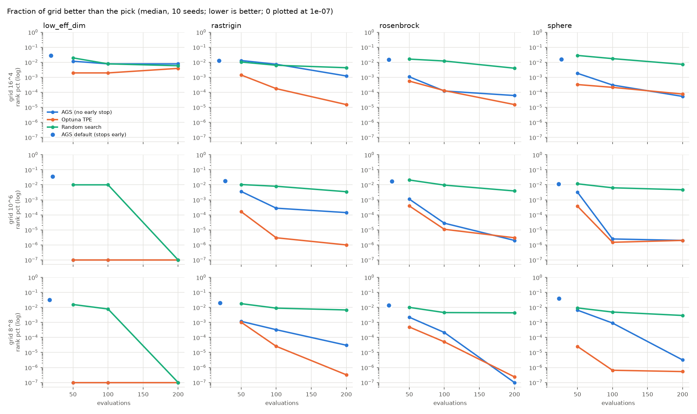
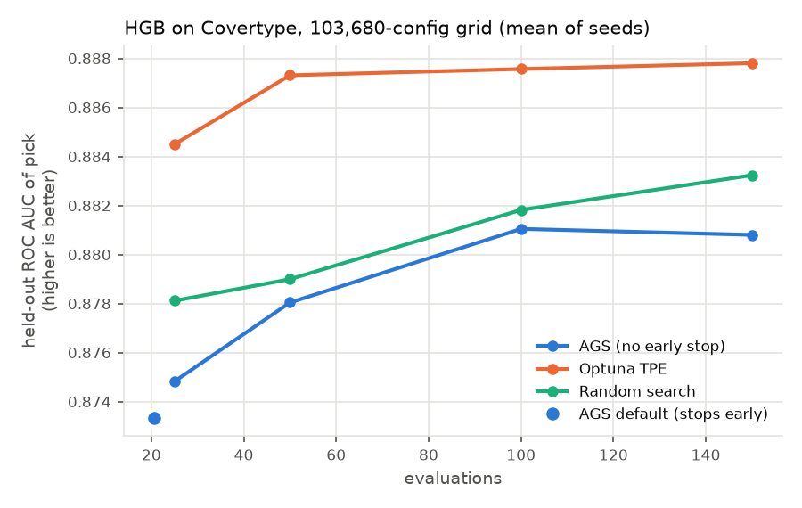

# Round 2: large search spaces

The package author says heavy-weight tuning is "not yet guaranteed". This round checks what happens when the grid grows from hundreds of configs to millions. It has four parts:

1. **Scaling probe.** Memory and time of AGS itself as the grid grows (`scaling_probe.py`).
2. **Synthetic landscapes** with an exact optimum, grids of 65k to 16.7M points (`synthetic_bench.py`).
3. **A real model** on a 103,680-config grid (`real_large.py`).
4. **Locality probe.** How far from its current best AGS actually looks (`locality_probe.py`).

Charts and tables are produced by `analyze_large.py`. Same environment as round 1: 4 CPU, no GPU, single-core fits.

## TL;DR

- **Hard ceiling around 10⁸ grid points.** AGS lists every grid point in memory when it is created (`__init__`), at about 100 bytes per point. 10⁷ points took 1.1 GB and 4.5 s before the first evaluation, and 10⁸ points hit MemoryError at a 6 GB cap. Optuna and random search don't have this limit.
- **Default early stopping ruins large-space runs.** With `early_stopping_patience=5`, AGS stopped after a median of 16–27 evaluations in the large-space runs. That is why the default runs in the charts below sit far behind even random search at 200 evaluations.
- **On smooth synthetic landscapes AGS beats random clearly, but trails Optuna.** At 200 evaluations, paired over 120 runs: vs random 91 wins / 20 ties / 9 losses, vs Optuna 28 / 48 / 44. At 50 evaluations it lost to Optuna 76 times out of 120.
- **On the real model, AGS was last.** Mean held-out AUC at 150 evaluations: Optuna 0.8878, random 0.8832, AGS 0.8808. Optuna's 5 seeds agreed within ±0.0008. AGS's spread was ±0.0054, and one seed ended at `learning_rate=0.5`, which looks like a stuck local climb.
- **It never looks far.** In 8 dimensions, over 90% of AGS evaluations stayed within 2 steps of the current best, and none went further than 3. It climbs whichever hill its 8 random starts land on, and misses taller hills elsewhere (§4).
- **Conclusion (interpretation):** the claim "not yet guaranteed for heavy-weight tuning" is fair. For large spaces the current version is not a safe default. Use Optuna, or at least turn off early stopping.

## 1. Scaling probe

A zero-cost fake model, so only AGS's own bookkeeping is measured. 100 evaluations per run, each size in a fresh process, with a 6 GB memory cap.

| grid | points | setup time | peak memory | time per evaluation |
|---|---|---|---|---|
| 10³ | 1,000 | <0.01 s | 0.15 GB | 1.5 ms |
| 10⁵ | 100,000 | 0.07 s | 0.16 GB | 1.4 ms |
| 10⁶ | 1,000,000 | 0.46 s | 0.25 GB | 1.6 ms |
| 10⁷ | 10,000,000 | 4.5 s | 1.1 GB | 1.5 ms |
| 32⁵ | 33,554,432 | 11.3 s | 2.9 GB | 1.4 ms |
| 10⁸ | 100,000,000 | — | **MemoryError** | — |

Cause: `self.all_states = list(itertools.product(...))` in `AdaptiveGreedySearch.__init__`. The same list is scanned in full by the fallback step (`remaining = [s for s in self.all_states ...]`). The benchmarks here never reached that step, but on a big grid each time it runs costs a scan of millions of points.

**Fix idea:** never build the list. Draw random grid points by index (`rng.integers` per dimension). Walk neighbours as the search already does. For the fallback, sample K random unevaluated points instead of scanning all of them.

## 2. Synthetic landscapes (exact ground truth)

Each grid point's "CV fold score" is −f(x) plus Gaussian noise (σ = 0.05 of f's spread over the grid), so every pick can be ranked exactly against the whole grid. AGS runs through its normal `fit()` path with a fake estimator and a callable scorer. Random and Optuna see identical noisy scores. 10 seeds.

| landscape | shape |
|---|---|
| sphere | smooth, single peak, optimum off-centre |
| rosenbrock | curved narrow valley |
| rastrigin | rugged, many local optima |
| low_eff_dim | only 2 of d parameters matter; the rest are flat |

Grids: 16⁴ = 65,536; 10⁶ = 1,000,000; 8⁸ = 16,777,216.

**Metric:** the fraction of the whole grid that is strictly better than the pick. 0 means the global optimum; 10⁻³ means the pick is in the top 0.1%. Lower is better.



*Median over 10 seeds. The dot marks AGS with default settings, where it stopped early.*

Full tables: [`results/synthetic_summary.md`](results/synthetic_summary.md). Pooled paired result, AGS (no early stop) vs each rival, 120 runs per budget:

| evaluations | vs Optuna W/T/L | vs Random W/T/L |
|---|---|---|
| 50 | 26 / 18 / 76 | 82 / 7 / 31 |
| 100 | 27 / 26 / 67 | 89 / 15 / 16 |
| 200 | 28 / 48 / 44 | 91 / 20 / 9 |

What it shows:
- AGS learns from its history and beats random search more clearly as the grid grows. This is the main place where the package delivers on its idea.
- Optuna gets good faster. At 50–100 evaluations it is often 10× or more closer to the optimum. By 200 evaluations the gap mostly closes on sphere and rosenbrock, and even reverses on 8⁸ rosenbrock.
- On rastrigin (rugged) Optuna stays ahead at every budget. That fits the README's own warning about landscapes without local structure.
- AGS default (early stop) picks were in the top 1–4% of the grid. Random with 200 evaluations did better on almost every panel. The early stop, not the algorithm, is what hurts here.

## 3. Real model: HistGradientBoosting on Covertype

Covertype data, class 1 vs 2. 3,000 training rows and 10,000 held-out test rows. 7 hyperparameters, 103,680 grid points:

```
learning_rate      0.005 0.01 0.02 0.05 0.1 0.2 0.3 0.5
max_leaf_nodes     4 8 16 31 63 127
max_depth          2 3 4 6 8 None
min_samples_leaf   2 5 10 20 50 100
l2_regularization  0 0.01 0.1 1 10
max_features       0.3 0.5 0.7 1.0
max_iter           50 100 200
```

The grid is too large to search exhaustively, so the score is the held-out ROC AUC of each method's pick. There were 5 seeds and 150 evaluations; the pick was also recorded at 25, 50 and 100.



| method | @25 | @50 | @100 | @150 | folds | wall s |
|---|---|---|---|---|---|---|
| AGS (no early stop) | 0.8748 | 0.8780 | 0.8810 | 0.8808 ± 0.0054 | 694 | 479 |
| Optuna TPE | **0.8845** | **0.8873** | **0.8876** | **0.8878 ± 0.0008** | 750 | 843 |
| Random | 0.8781 | 0.8790 | 0.8818 | 0.8832 ± 0.0030 | 750 | 175 |
| AGS default | stopped at ~21 evals: 0.8733 | | | | 102 | 29 |

Every pick and its parameters are listed in [`results/real_large_summary.md`](results/real_large_summary.md).

What it shows:
- 5 seeds is few, so read the ordering with care. Still, Optuna led at every budget, by margins about as large as or larger than the seed-to-seed spread.
- All 5 Optuna seeds converged to the same region: `lr 0.05–0.1, 127 leaves, no depth cap, min_samples_leaf 2, 200 iters`. AGS seeds were more scattered: learning rates from 0.05 to 0.5, and 63 or 127 leaves. Interpretation: the neighbour-by-neighbour climb gets stuck in local optima in 7 dimensions.
- Wall time differs because some configs cost more than others, not only because of the method. Random samples many cheap configs (such as 50 iterations or shallow trees). AGS and Optuna climb toward the expensive region (200 iterations, 127 leaves). AGS pruning saved about 7% of folds.

## 4. Why it gets stuck: it never looks far

**How AGS chooses its next point** (`core.py`):
1. It evaluates the unchecked direct neighbours of the current best point.
2. Only when *all* direct neighbours have been checked (not when they are merely bad) does it look at the ring 2 steps away, then 3, then 4. It stops at the first ring that still has an unchecked point.
3. Only when nothing is unchecked within 4 steps does it pick from the whole grid.

"Up to 4 steps" sounds wide, but the rings grow very fast with the number of parameters. With 7–8 parameters, rings 1 and 2 alone hold 112–144 points, which uses up a typical budget before ring 3 is reached. `locality_probe.py` measures this directly:

AGS with early stopping off, 200 evaluations, 10 seeds per row. Share of evaluations (after the 8 random starts) by grid distance from the current best point.

| grid | landscape | 1 step | 2 steps | 3 steps | 4 steps | 5 steps | 6+ steps |
|---|---|---|---|---|---|---|---|
| 16^4 | sphere | 37% | 28% | 33% | 2% | 0% | 0% |
| 16^4 | rosenbrock | 30% | 18% | 38% | 14% | 0% | 0% |
| 16^4 | rastrigin | 19% | 36% | 45% | 0% | 0% | 0% |
| 16^4 | low_eff_dim | 21% | 28% | 38% | 13% | 0% | 0% |
| 8^8 | sphere | 85% | 15% | 0% | 0% | 0% | 0% |
| 8^8 | rosenbrock | 64% | 36% | 0% | 0% | 0% | 0% |
| 8^8 | rastrigin | 44% | 56% | 0% | 0% | 0% | 0% |
| 8^8 | low_eff_dim | 31% | 60% | 9% | 0% | 0% | 0% |

Grid points at exact distance r from one interior point:

| parameters | r=1 | r=2 | r=3 | r=4 |
|---|---|---|---|---|
| 2 | 4 | 8 | 12 | 16 |
| 4 | 8 | 32 | 88 | 192 |
| 7 | 14 | 98 | 462 | 1,666 |
| 8 | 16 | 128 | 688 | 2,816 |

What it shows:
- **In 8 dimensions, over 90% of evaluations stayed within 2 steps of the current best.** On three of the four landscapes that figure is 100%.
- **No evaluation in any run was more than 4 steps away**, so the whole-grid fallback never ran.
- Apart from the 8 random starts, AGS only explores the hill it is currently on. It can drift uphill along a slope, but it cannot cross a valley to reach a taller hill further away. If none of the 8 starts lands on the best hill, it will not find that hill.
- This explains the results in §2 and §3. On sphere, which has one hill, local search is enough. On rastrigin and the real model, which have many hills, seeds get stuck on different local optima.
- Optuna's TPE works differently. It draws 24 candidates around *all* of its top ~10% of points and evaluates the most promising one, so a far-away good region keeps getting visits.

## Suggestions (large-space specific)

1. Don't enumerate the full grid (see §1). It is required for any "heavy-weight" claim.
2. Scale the early-stopping patience with the budget or the number of dimensions, or disable it by default. A fixed 5 is far too small in 7–8 dimensions: a single sweep of radius-1 neighbours around one point is 14–16 configs.
3. Add restarts: after K evaluations without improvement, jump to a new random point and climb again, keeping the best overall result. This addresses the stuck seeds on the real task and on rastrigin (§4).
4. Climb from several good points, not only the single best (for example, round-robin over the top 3).
5. Mix in global picks: every N-th evaluation, choose from the whole grid using the surrogate, on a random sample of points rather than a full scan.
6. Re-run this round after fixes. Everything here is reproducible:

```bash
cd large
python scaling_probe.py        # ~1 min
python synthetic_bench.py      # ~5 min on 4 cores
python real_large.py           # ~40 min on 4 cores (downloads Covertype, ~11 MB)
python locality_probe.py       # ~2 min
python analyze_large.py
```
